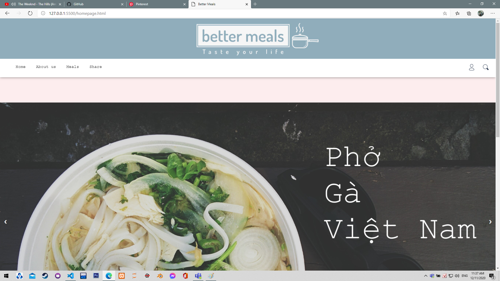
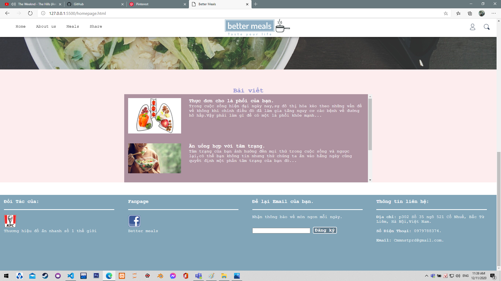
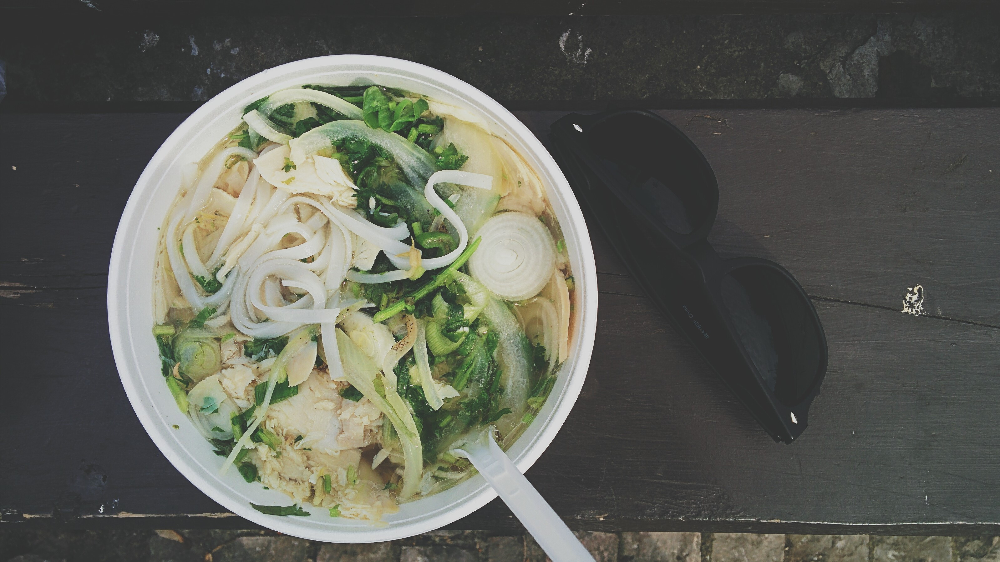
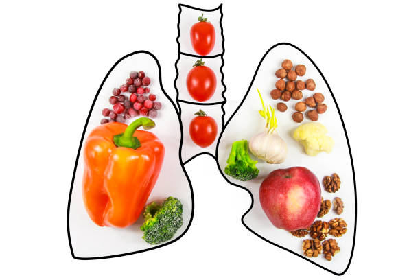
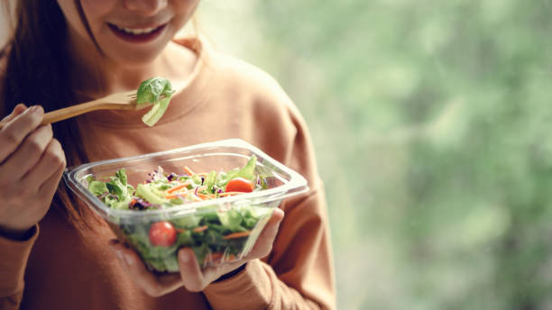
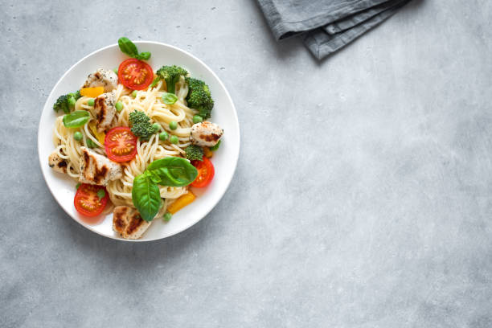

# BÀI THU HOẠCH CHƯƠNG 4 - HỌC PHẦN : ĐIỆN TOÁN ĐÁM MÂY VÀ ỨNG DỤNG
- Sinh viên thực hiện : Nguyễn Minh Thông
- Mã sinh viên : 1821050949
- Mục tiêu : Tạo ra một tài liệu hướng dẫn triển khai ứng dụng web trên nền tảng dịch vụ điện toán đám mây.
## Giới thiệu
**Heroku Web App** là một nền tảng đám mây cho phép các lập trình viên xây dựng, triển khai, quản lý và mở rộng ứng dụng (Paas - Platform as a service). Chúng ta có thể liên kết với tài khoản github để dễ dàng thay đổi thực hiện ngay trong **Github Actions**.
Trong bài viết này tôi sẽ tạo ra một "tài liệu" hướng dẫn các bạn tiến hành xây dụng một ứng dụng web và triển khai nó theo giải pháp điện toán đám mây **Heroku**.


```html
<!DOCTYPE html>
<html lang="en">

<head>
    <meta charset="UTF-8">
    <meta name="viewport" content="width=device-width, initial-scale=1.0">
    <link rel="stylesheet" href="./css/style.css">
    <link rel="stylesheet" href="./css/home.css">
    <script src="./js/main.js"></script>
    <title>Better Meals </title>
</head>

<body>
    <header>
        
    </header>
    <div class="logo1">
        
    </div>
    <div class="nav-container">
        <div class="user-container">
            
            <div class="sign-in">
                <a href="">Sign In</a>
                <a href="">Sign Up</a>
            </div>
        </div>
        
        <nav>
            <ul>
                <li><a href="homepage.html">Home</a></li>
                <li><a href="aboutus.html">About us</a></li>
                <li><a href="meals.html">Meals</a></li>
                <li><a href="">Share</a></li>
            </ul>
        </nav>
    </div>
    <div class="content">
        <br>
        <div class="slide-container">
            <picture class="slides">
                
                
                
                
            </picture>
            <a class="prev" id="prev">&#10094;</a>
            <a class="next" id="next">&#10095;</a>
        </div>
        <h2 style="text-align: center; margin-top: 7vh; color: rgb(139, 140, 210);"> <strong>Bài viết</strong></h2>
        <div class="news-container">
            <section class="news">
                
                <div class="col-9">
                    <h3>Thực đơn cho lá phổi của bạn.</h3>
                    <p>Trong cuộc sống hiện đại ngày nay,sự đô thị hóa kéo theo những vấn đề về không khí chính điều đó
                        đã làm gia tăng nguy cơ các bệnh về đường hô hấp.Vậy phải làm gì để có một lá phổi khỏe mạnh...
                    </p>
                </div>
            </section>
            <section class="news">
                
                <div class="col-9">
                    <h3>Ăn uống hợp với tâm trạng.</h3>
                    <p> Tâm trạng của bạn ảnh hưởng đến mọi thứ trong cuộc sống và ngược lại,có thể bạn không tin nhưng
                        thứ chúng ta ăn vào hằng ngày cũng quyết định một phần tâm trạng của bạn đó...</p>
                </div>
            </section>
            <section class="news">
                
                <div class="col-9">
                    <h3>Trổ tài nấu nướng với gia đình người ấy.</h3>
                    <p>Nếu bạn là một cô gái đang chuẩn bị ra mắt gia đình người yêu thì còn gì tuyệt vời hơn khi có cho
                        mình một thực đơn làm hài lòng các bậc phụ huynh,còn nếu bạn là một chàng trai thì biết nấu ăn
                        cũng sẽ là một điểm cộng lớn đấy...</p>
                </div>
            </section>
        </div>
    </div>
    <footer style="background-color:#81a5b8; margin-top: 5vh; max-width: 100%; min-height: 30vh; color: white;">
        <div class="col-3">
            <h3>Đối Tác của:</h3>
            <br>
            <hr>
            <br>
            <a href="https://kfcvietnam.com.vn"></a><br>
            <p>Thương hiệu đồ ăn nhanh số 1 thế giới</p>
        </div>
        <div class="col-3 ">
            <h3>Fanpage</h3>
            <br>
            <hr>
            <br>
            <a href="https://www.facebook.com/profile.php?id=100010260390327"></a><br>
             <p>Better meals</p>   
        </div>
        <div class="col-3">
            <h3>Để lại Email của bạn.</h3>
            <br>
            <hr>
            <br>
            <p>Nhận thông báo về món ngon mỗi ngày.</p>
            <form action="" style="margin-top: 3vh;">
                <input type="text" style="min-width:50%;" class="email">
                <input class="submit-email" type="submit" value="Đăng ký" class="submit1">
            </form>
        </div>
        <div class="col-3">
            <h3>Thông tin liên hệ:</h3>
            <br>
            <hr>
            <br>
            <p> <b>Địa chỉ: </b>p302 Số 35 ngõ 521 Cổ Nhuế, Bắc Từ Liêm, Hà Nội,Việt Nam.</p><br>
            <p><b>Số Điện Thoại: </b> 0979788374.</p><br>
            <p><b>Email:</b> Cmmnstprd@gmail.com.</p>

        </div>
    </footer>
</body>

</html>
```


