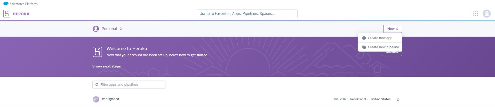
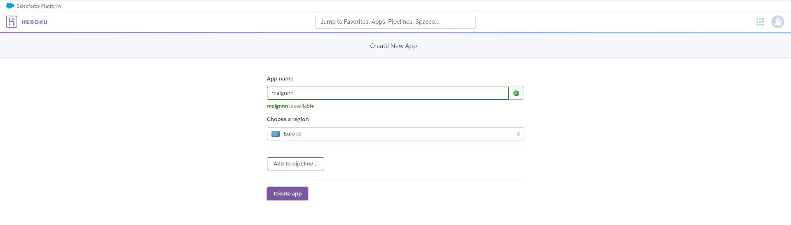
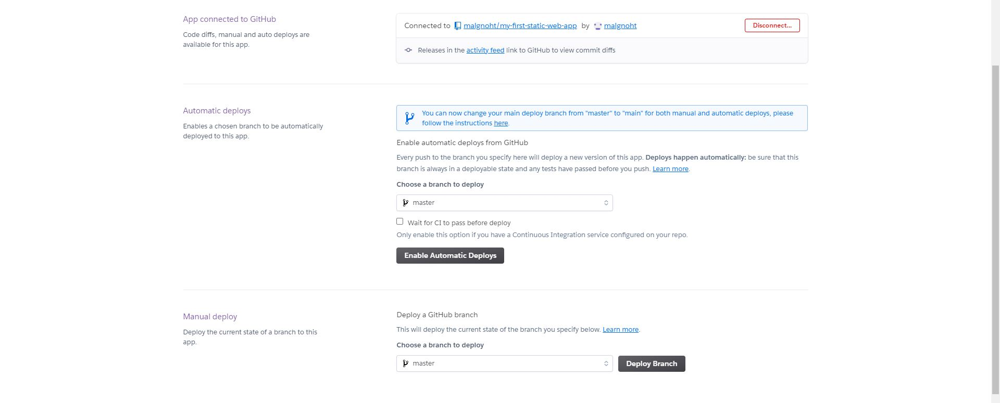
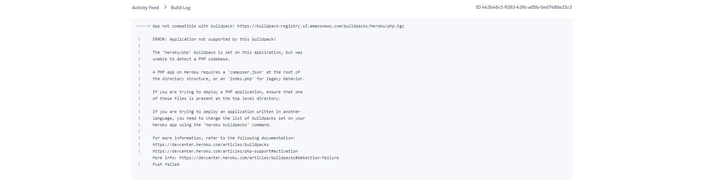

# BÀI THU HOẠCH CHƯƠNG 4 - HỌC PHẦN : ĐIỆN TOÁN ĐÁM MÂY VÀ ỨNG DỤNG
- Sinh viên thực hiện : Trịnh Văn Thông
- Mã sinh viên : 1821050939
- Mục tiêu : Tạo ra một tài liệu hướng dẫn triển khai ứng dụng web trên nền tảng dịch vụ điện toán đám mây.
## Giới thiệu
**Heroku Web App** là một nền tảng đám mây cho phép các lập trình viên xây dựng, triển khai, quản lý và mở rộng ứng dụng (Paas - Platform as a service). Chúng ta có thể liên kết với tài khoản github để dễ dàng thay đổi thực hiện ngay trong **Github Actions**.
Trong bài viết này tôi sẽ tạo ra một "tài liệu" hướng dẫn các bạn tiến hành xây dụng một ứng dụng web và triển khai nó theo giải pháp điện toán đám mây **Heroku**.

## Mở đầu
Heroku cung cấp dịch vụ máy chủ đám mây giúp dễ dàng trong việc deploy ứng dụng. Điều tuyệt vời ở Heroku là trang này bạn có thể sử dụng dịch vụ hoàn toàn miễn phí với các ứng dụng web không yêu cầu phải có tốc độ truy câp dung lương lớn.
Trong bài viết này chúng ta sẽ cùng làm với nhau 4 việc :
- Tải Heroku CLI
- Tạo một dự án trên Heroku
- Cấu hình Git server repository cho phía local
- Deploy ứng dụng

## Điều kiện tiên quyết
- Có tài khoản [GitHub](https://github.com/)
- Có tài khoản [Heroku](https://dashboard.heroku.com/)
- Môi trường viết mã [Visual Studio Code](https://code.visualstudio.com/)

## Tải Heroku CLI
Các bạn truy cập vào đường link [The Heroku CLI](https://devcenter.heroku.com/articles/heroku-cli) để tải Heroku CLI về máy. Chọn các phiên bản phù hợp với thiết bị của bạn. Có rất nhiều phiên bản để các bạn lựa chọn.

## Tạo dự án trên Heroku
Để tạo dự án trên *Heroku*, bạn cần tạo một tài khoản (hoàn toàn miễn phí) sau đó kích hoạt và đăng nhập vào địa chỉ [https://dashboard.heroku.com/](https://dashboard.heroku.com/). Sau khi đăng nhập vào địa chỉ này, bạn sẽ thấy một nút New dùng để tạo một dự án. Click vào sau đó chọn Create New App :



## Tạo Git Repository trên máy Local
Đầu tiên các bạn tải cho tôi phần mềm GIT để thuận tiện cho việc deploy ứng dụng web.Sau đó bạn đăng nhập tài khoản heroku

Bây giờ trên máy tính local, chúng ta cần khởi tạo Git local repository (hay local repo). Local repo giống như một cái kho, nơi chứa source code mà bạn sẽ dùng để phát triển ứng dụng. Trên terminal di chuyển tới thư mục ở máy tính của bạn và chạy câu lệnh sau :


## Triển khai ứng dụng của bạn
Commit code của bạn vào kho lưu trữ và triển khai nó đến Heroku bằng Git.


Đối với  repositories có sẵn bạn chỉ cần đơn giản thêm một Heroku remote:


Sau khi bạn chạy lệnh  $ push heroku ứng dụng của bạn sẽ được đẩy từ local lên nền tảng đám mây Heroku

Bạn cũng có thể deploy ứng dụng từ kho mã nguồn của Github bằng cách kết nối với Github

Sau đó bạn chọn repositories cần deploy

Bước tiếp theo bạn cần chọn nhánh và bấm Deploy Branch để hoàn thành công việc.Sau đó bạn có thể bấm vào Open app để xem kết quả

Nếu bạn deploy ứng dụng với kho mã nguồn github thì ở góc trái của repositories sẽ xuất hiện 

Bấm vào Enviroments-> View Deployment  để xem kết quả.
## Một số lỗi thường gặp khi triển khai ứng dụng trên nền tảng Heroku
Trong quá trình triển khai ứng dụng tôi đã gặp phải một số lỗi như sau

Lỗi sai nhánh,Lỗi này xảy ra khi nhánh (Branch) mà bạn chọn sai.Lúc này bạn cần xem lại nhánh và chọn lại.

Lỗi thứ 2 mà mình muốn nhắc đến chính là lỗi :

Lỗi này xảy ra do Heroku buildpack không thể đọc được ngôn ngữ mà bạn triển khai (Ví dụ: Html,..)

Hoặc buildpack chưa được cài đặt để hỗ trợ ngôn ngữ đó ở ứng dụng này mình đã fix lỗi bằng cách truy cập https://buildpack-registry.s3.amazonaws.com/buildpacks/heroku/php.tgz và cài đặt buldpack cho PHP sau đó thêm một file index.php vào source code với nội dung
``` PHP
<?php 
require_once('homepage.html');
/// gọi file html
?>
```
để buildpack có thể đọc được file.Sau đó mình deploy lại và đã thành công.Đây là ứng dụng của mình sau khi được triển khai

**Cảm ơn các bạn đã theo dõi tài liệu của tôi. Chúc các bạn thành công!**
